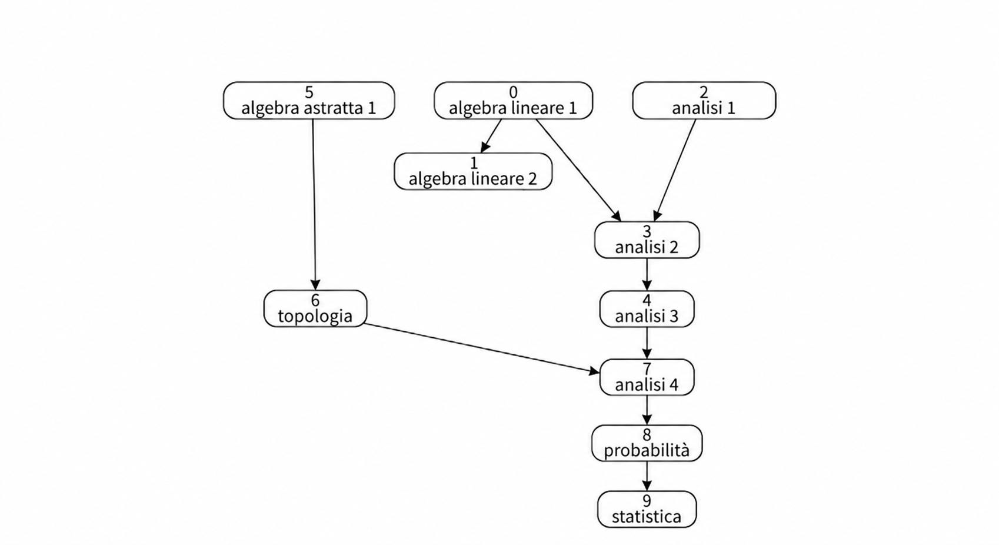
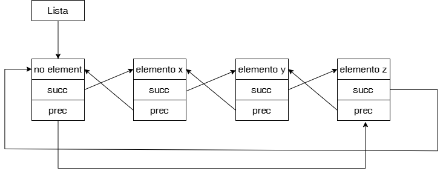
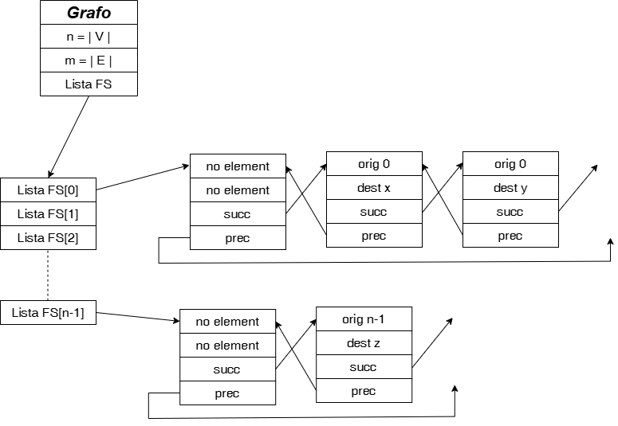

# Course Schedule

Implementazione in linguaggio C di un algoritmo su grafi per determinare l'ordine in cui sostenere degli esami universitari 
preso atto dei vincoli di propedeuticità: in altre parole se gli esami $X$ ed $Y$ sono prerequisito per l'esame $Z$, allora l'algoritmo dovrà restituire che prima 
di poter sostenere l'esame $Z$ lo studente dovrà sostenere gli esami $X$ ed $Y$.  
Nella modellizzazione su grafo, ciascun corso sarà un nodo di un grafo orientato; detti $v, w$ due nodi del grafo, l'arco non pesato $(v,w)$ da $v$ in $w$ indicherà che il corso $v$ è
prerequisito per il corso $w$.  
L'input, ovverosia il numero di esami ed il modo in cui essi si intrecciano sotto forma di rispettivi prerequisiti saranno presi da un file di testo formattato, 
modificabile anche da un utente.


## Formato di input

Il programma legge i dati da un file di testo, come ad esempio [Input_01.txt](Input_01.txt). Il file deve essere strutturato nel seguente modo:  
La prima riga contiene un intero $N$, che rappresenta il numero totale dei corsi universitari da seguire. La seconda riga contiene una sequenza di coppie di interi nel formato [corso, prerequisito] separate da virgola.  
Esempio di input:  
```
4  
[1,0], [2,0], [3,1], [3,2]
```
In questo esempio ci sono 4 corsi (numerati da 0 a 3). L'esame 0 è propedeutico sia per il corso 1 che per il corso 2. Gli esami 1 e 2 sono 
prerequisito per il 3.  
In questo caso una possibile soluzione sarà: &nbsp; "0 2 1 3"  

Sono stati predisposti 12 diversi file input, numerati da 01 a 12. Nel file [Soluzioni_Input.txt](Soluzioni_Input.txt), creato solo per l'utente umano, sono contenute le soluzioni
dei 12 file input già predisposti. Ovviamente l'utente potrà creare dei nuovi e diversi possibili file input, purché sia rispettato il formato di 
scrittura di cui sopra.
Se nessun corso ammette prerequisiti si può lasciare vuota la seconda riga (cfr. [Input_11.txt](Input_11.txt)) o inserire due parentesi quadre vuote [ ] per indicare una lista vuota (cfr. [Input_03.txt](Input_03.txt))

## La modellizzazione del problema
Il problema è stato modellizzato mediante un grafo. In tale grafo i nodi saranno gestiti con numeri anziché con stringhe, per non appesantire la 
ricerca e le varie azioni sul grafo, si creerà quindi una biezione tra 
gli N esami universitari ed {0, 1, ..., N-1} $\subseteq$ ℕ.  
Si consideri il seguente esempio, dove a ciascun esame è assegnato anche un intero progressivo di lettura:    

&nbsp; &nbsp; &nbsp; 0 $\longleftrightarrow$ algebra lineare 1 (prerequisito per analisi 2 e per algebra lineare 2)  
&nbsp; &nbsp; &nbsp; 1 $\longleftrightarrow$ algebra lineare 2  
&nbsp; &nbsp; &nbsp; 2 $\longleftrightarrow$ analisi 1 (prerequisito per analisi 2)  
&nbsp; &nbsp; &nbsp; 3 $\longleftrightarrow$ analisi 2 (prerequisito per analisi 3)  
&nbsp; &nbsp; &nbsp; 4 $\longleftrightarrow$ analisi 3 (prerequisito per analisi 4)  
&nbsp; &nbsp; &nbsp; 5 $\longleftrightarrow$ algebra astratta 1 (prerequisito per topologia)  
&nbsp; &nbsp; &nbsp; 6 $\longleftrightarrow$ topologia (prerequisito per analisi 4)  
&nbsp; &nbsp; &nbsp; 7 $\longleftrightarrow$ analisi 4 (prerequisito per probabilità)  
&nbsp; &nbsp; &nbsp; 8 $\longleftrightarrow$ probabilità (prerequisito per statistica)  
&nbsp; &nbsp; &nbsp; 9 $\longleftrightarrow$ statistica  

ed il grafo associato sarà della forma:

<div align="center">
  
</div>

Con tale input, una possibile soluzione può essere: &nbsp; "5 6 0 2 1 3 4 7 8 9",  
tuttavia anche &nbsp; "0 1 2 5 6 3 4 7 8 9" &nbsp; è una soluzione accettabile.  

Si osservi infatti che non è detto che l'ordine sia unico, tuttavia, se per un dato input esistono più soluzioni ugualmente accettabili, l'algoritmo 
convergerà ad una di queste.  
Non è nemmeno detto che per il generico input la soluzione esista, in effetti, se il grafo orientato presenta dei cicli, allora sicuramente il problema non ammette 
soluzioni; analogamente, se il grafo risulta essere partizionabile in più componenti (semplicemente) connesse, dove in una di queste non sia presente un nodo 
che abbia zero prerequisiti, allora, ancora una volta, sicuramente l'input non ammette soluzione (e sarà necessariamente presente almeno un ciclo).  
Si osservi poi che esistono input particolari tali per cui la soluzione sia unica.  
Se il problema non ammette soluzione, l'algoritmo stamperà a video un appropriato messaggio di testo. Alternativamente, se l'input ammette soluzioni, l'algoritmo 
stamperà a video una delle possibili soluzioni.  

## Strutture dati utilizzate e loro implementazione
Per risolvere il problema sono state utilizzate le linked list, i grafi, i vettori e le code di interi.

Le liste sono state implementate come linked list con puntatori, cicliche, bidirezionali, con sentinella.  
Un nodo di questa lista è una struct contenete tre campi: l'elemento, il puntatore al nodo successivo ed il puntatore al nodo precedente.  
La lista sarà un puntatore ad un nodo della lista stessa, e tale nodo sarà il cosiddetto "nodo sentinella", cioè un nodo fittizio, la sua presenza 
è utile per capire se in un ciclo for o while sia stata scandita tutta la lista (in effetti, se il puntatore al nodo successivo del nodo in esame è uguale al puntatore lista, allora ho scorso tutta la lista ed il nodo in esame è l'ultimo della linked list).
<br>
<div align="center">
  
</div>
<br>

Il vantaggio delle linked list è che, a differenza dei vettori, consentono inserimenti e cancellazioni in tempo $\Theta(1)$ poiché è sufficiente creare 
un nuovo nodo e sistemare 4 puntatori, mentre invece in un vettore si renderebbe necessario anche traslare tutti gli altri elementi. Tuttavia,
lo svantaggio delle linked list è che per accedere all'elemento k-esimo della lista il costo computazionale sarebbe $\Theta(k)$ poichè si renderebbe 
necessario far scorrere tutti i k-1 puntatori "succ" precedenti, a differenza dei vettori dove l'accesso all'elemento k-esimo avviene in tempo costante 
$\Theta(1)$. Tuttavia, se l'algoritmo richiede, come in questo caso (vedremo in seguito), che ogni volta che si accede all'elemento k-esimo si deve già anche aver acceduto a tutti i precedenti k-1 nodi della lista, allora il vantaggio di utilizzare i vettori anziché le linked list è nullo.

I grafi sono stati implementati con liste forward-stars.  
In questa implementazione, un grafo è una struct contenente $n:=|V|, m:=|E|$ ed un puntatore ad un vettore (detto costola) di puntatori a liste di archi.  
Un nodo di una lista di archi è una struct contenente il nodo origine, il nodo destinazione, il puntatore all'arco successivo ed il puntatore 
all'arco precedente. La lista forward star del nodo v è la lista degli archi uscenti dal nodo v. La costola del grafo è il vettore delle liste forward star,
in particolare, l'elemento k-esimo della costola sarà un puntatore alla lista degli archi uscenti dal nodo k, cioè un puntatore alla lista forward star
del nodo k. Le liste forward star sono state implementate come linked list circolari bidirezionali con sentinella.  
Rappresentativamente, il grafo apparirà come:  

<div align="center">
  
</div>

Il vantaggio di rappresentare il grafo mediante liste forward stars, anziché tramite matrici di adiacenza, è il notevole risparmio di memoria allocata, in effetti,
lo spazio necessario per allocare un grafo con liste FS è pari a $\Theta(n+m)$ tra costola e liste, mentre lo spazio necessario ad allocare
un grafo mediante matrici di adiacenza è di $\Theta(n^2)$, pertanto, eccezion fatta per il caso (molto atipico in questo contesto) di grafi densi dove $m \approx n^2$ ) il risparmio di spazio è considerevole poichè si abbatte da quadratico a lineare.  
Lo svantaggio è tuttavia che il costo computazionale necessario per accedere
all'arco $(v,w)$ è pari a $\Theta( \delta_{v}^{+} )$, dove $\delta_{v}^{+}$ indica il numero di archi uscenti dal nodo $v$.

Tra le altre strutture dati utilizzate ci sono anche i vettori e le code di interi.  
La coda di interi (int queue) è una classica coda i cui elementi sono nodi che possono contenere solo numeri interi, ed è stata per semplicità implementata mediante un vettore e due interi come indici posizione (che fungono quindi da "puntatori") denominati head e tail.  
La coda di interi rispetta la gerarchia FIFO (first in first out) tipica di tutte le code.

Sono state implementate anche delle funzioni di libreria, consultabili nei file:  
[Liste_Archi.h](Liste_Archi.h), [Liste_Archi.c](Liste_Archi.c), [Grafi.h](Grafi.h), [Grafi.c](Grafi.c), 
[Code_Di_Interi.h](Code_Di_Interi.h) ed [Code_Di_Interi.c](Code_Di_Interi.c).


## Algoritmo di risoluzione

Dopo aver letto l'input, interpretato il formato e caricato i dati in un grafo, l'algoritmo procede ad eseguire una prima lettura di tutto il grafo (andando ad eseguire un ciclo for sulla costola ed un ciclo annidato sulla lista FS, il tutto in tempo $\Theta(m)$, lineare nel numero di archi) e calcola per ciascun corso v quanti siano i suoi prerequisiti.  
Per fare ciò si utilizza un vettore di interi chiamato `numero_di_prerequisiti`, esso è un vettore con la proprietà tale per cui `numero_di_prerequisiti[v]` indica il numero di esami che è necessario sostenere prima di poter sostenere l'esame v.  
L'inizializzazione del vettore `numero_di_prerequisiti` avviene tramite un ciclo for sulla costola ed un ciclo for (annidato)
sulle liste FS del nodo in esame, si accede pertanto a ciascuno degli $\delta_{v}^{+}$ archi della forma (v,w), si memorizza la destinazione w dell'arco, e si incrementa `numero_di_prerequisiti[w]` di 1.

Si osservi che `numero_di_prerequisiti[w]` = $\delta_{w}^{-}$, cioè il numero di archi entranti nel nodo $w$. Osservato ciò si potrebbe pensare che per affrontare il problema sarebbe stato preferibile implementare il grafo con liste di archi entranti anziché con liste di archi uscenti (le forward star), in realtà non ci sarebbe nessun vantaggio in termini di costo computazionale perché comunque bisogna necessariamente accedere a ciascuno degli m archi (v,w), rendendo dunque il costo temporale comunque non inferiore a $\Theta(m)$, si è preferito quindi lasciare il grafo implementato con liste FS per non perdere una maggior leggibilità del codice.  

Viene poi definito anche un vettore `soluzione`, in cui progressivamente si andranno ad inserire gli esami che man mano diventeranno sostenibili poiché si saranno sostenuti tutti i loro esami prerequisito.

Una volta inizializzato il vettore `numero_di_prerequisiti`, il problema viene risolto con quella che essenzialmente è una visita in ampiezza (una BFS - breadth first search) con l'accortezza però che un nodo sarà utilizzato per visitare i nodi ad esso adiacenti solo quando saranno stati visitati anche tutti i suoi prerequisiti.  
L'idea di fondo è la seguente: si inseriscono nel vettore `soluzione` ed anche in una coda di interi `Q` tutti e soli i nodi del grafo che abbiano zero prerequisiti (il criterio con cui li si inserisce in coda e nel vettore soluzione è uno dei tanti fattori che determinerà a quale delle possibili soluzioni l'algoritmo convergerà, noi comunque abbiamo optato per un semplice criterio di numerazione crescente, non essendo interessati ad una soluzione particolare), dopodiché, fintanto che la coda `Q` non è vuota si estrae da `Q` il nodo v in cima, tale elemento v viene dunque usato per visitare i nodi ad esso adiacenti, facendo scorrere la sua lista FS. Per ogni nodo w nella FS di v si decrementa `numero_di_prerequisiti[w]` di 1, poiché un prerequisito di w, cioè v, è stato appena tolto ed utilizzato infatti per la visita del grafo; inoltre, se `numero_di_prerequisiti[w]` è appena sceso a 0, si inserisce w nel vettore `soluzione` e si inserisce anche w nella coda `q`.  
Al termine del processo, la cardinalità del vettore `soluzione` ci dirà se ci sia effettivamente una soluzione (cosa che accade se e solo se il vettore `soluzione` ospita tutti gli n nodi del grafo) oppure se il grafo presenta un ciclo (e quindi non ci sia effettivamente una soluzione).  

La procedura appena descritta ha in realtà un nome ben preciso: trattasi dell'*algoritmo di Kahn* per *l'ordinamento topologico* di un grafo orientato. 
Un ordinamento dei nodi di un grafo orientato viene detto topologico quando l'ordinamento dei nodi rispetta la proprietà secondo la quale:  
&nbsp; &nbsp; se esiste l'arco (v,w) allora il nodo v deve precedere il nodo w.


## Analisi dei costi computazionali

Analizzeremo qui solo i costi computazionali del calcolo della soluzione, non saranno analizzati i costi computazionali per l'interpretazione dell'input ed il caricamento dell'input in un grafo (cosa che comunque avviene con un costo computazionale lineare in n+m) e non analizzeremo i costi computazionali per deallocare le strutture dati allocate dinamicamente come ad esempio il grafo (cosa che, ancora una volta, avviene linearmente).  
Sia $G:=(V,E)$ il grafo, con $n:=|V|, m:=|E|$.

Per inizializzare il vettore dei prerequisiti, avviene che, in pseudocodice:  

&nbsp;         for k = 0, 1, ..., n-1  
&nbsp; &nbsp; &nbsp;     numero_di_prerequisiti[ k ] = 0;


&nbsp;         for k = 0, 1, ..., n-1  
&nbsp; &nbsp; &nbsp;     for (k, j) $\in$ FS[k]  
&nbsp; &nbsp; &nbsp; &nbsp; &nbsp;   LeggiDestinazioneArco( (k, j) );  
&nbsp; &nbsp; &nbsp; &nbsp; &nbsp;   numero_di_prerequisiti[ j ]++;  

Il costo computazionale per fare ciò è pari ad:

$$
\sum_{k=0}^{n-1} \Theta(1) + \sum_{k=0}^{n-1} \sum_{(k,j) \in FS[k]} \Theta(1) = 
\Theta \left(\sum_{k=0}^{n-1} 1 \right) + \sum_{k=0}^{n-1} \Theta(1) \sum_{(k,j) \in FS[k]} 1 =
\Theta(n) + \sum_{k=0}^{n-1} \Theta(1) \cdot \delta_{k}^{+} =
$$ 

$$
= \Theta(n) + \sum_{k=0}^{n-1} \Theta(\delta_{k}^{+}) =
\Theta(n) + \Theta \left( \sum_{k=0}^{n-1} \delta_{k}^{+} \right) =
\Theta(n) + \Theta(m) = 
\Theta(n+m)
$$

<br>
<br>
Per quanto riguarda la visita del grafo, lo pseudocodice è il seguente:  
<br>
<br>

cont_soluz = 0;  
coda Q;  
&emsp;         for k = 0, 1, ..., n-1  
&emsp; &emsp; &emsp;     if( prerequisiti[k] = 0 )  
&emsp; &emsp; &emsp; &emsp; &emsp;     Enqueue(k, Q);  
&emsp; &emsp; &emsp; &emsp; &emsp;     soluzione[cont_soluz] = k;  
&emsp; &emsp; &emsp; &emsp; &emsp;     cont_soluz++;  

while( IsEmpty(Q) = false ){  
&emsp;         v = Front(Q);  
&emsp;         Dequeue(Q);  
&emsp;         for( (v,w) $\in$ FS[v] ){  
&emsp; &emsp; &emsp;     w=LeggiDestinazioneArco( (v,w) );  
&emsp; &emsp; &emsp;     prerequisiti[w]--;  
&emsp; &emsp; &emsp;     if( prerequisiti[w] = 0){  
&emsp; &emsp; &emsp; &emsp; &emsp;     soluzione[cont_soluz] = w;  
&emsp; &emsp; &emsp; &emsp; &emsp;     cont_soluz++;  
&emsp; &emsp; &emsp; &emsp; &emsp;     Enqueue(w, Q);  
&emsp; &emsp; &emsp;     }  // end if
&emsp;         } // end ciclo for sulla FS di v  
} // end while(coda vuota)  

Per calcolare il costo computazionale di questa seconda parte di codice è essenziale notare che ciascun nodo entra nella coda Q al più una volta,  
pertanto, il costo computazionale di questa seconda parte di codice è:  

$$
\sum_{k=0}^{n-1} \Theta(1)  +  \sum_{k=0}^{n-1} \left( \Theta(1) + \sum_{(k,w) \in FS[k]} \Theta(1) \right) =
\Theta \left( \sum_{k=0}^{n-1} 1 \right) + \sum_{k=0}^{n-1} \left( \Theta(1) + \Theta(\delta_{k}^{+}) \right) = 
$$

$$
= \Theta(n) + \sum_{k=0}^{n-1} \Theta(\delta_{k}^{+}) = 
\Theta(n) + \Theta(m) =
\Theta(n+m)
$$

<br>
Di conseguenza, il costo computazionale totale per calcolare l'ordine degli esami da sostenere è pari ad  
<br>
<br>

$$
Time(Course \textunderscore Schedule) = \Theta(n+m) + \Theta(n+m) = \Theta(n+m)
$$


